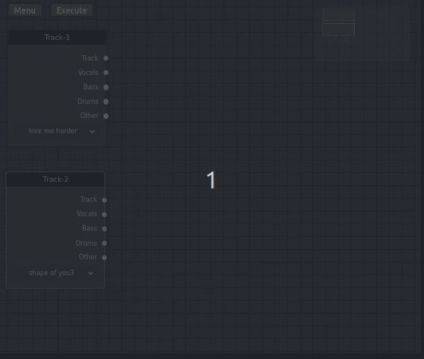

# AUTOMASHUP

Automashup is a Python application that allows you to generate a mashup from several songs 

## A workflow app which generates mashups

Hello there! We're a group of students who worked to develop a web application that aims to create mashups automatically.

## How does it work?

Given several songs, our app uses state-of-the-art tools to separate the sources of the songs and then to reunite them to create a new song.

## [Survey](http://automashup.ddns.net:8080/)

We're making a survey to improve our methods, please help us by **[taking part!](http://automashup.ddns.net:8080/)**

## Examples of mashups

*Shameless & Shivers*

<audio controls>
    <source src="examples/Shameless%20&%20Shivers.wav" type="audio/wav">
Your browser does not support the audio element.
</audio> 

*Secret Story of the Swan & Where We Started*

<audio controls>
  <source src="examples/SecretStoryoftheSwan%20&%20WhereWeStarted.wav" type="audio/wav">
Your browser does not support the audio element.
</audio> 

