We strongly recommend the use of a computer, the interface is not optimized for touchscreens.

### Import and preprocess songs

Browse through the files on your computer to import the songs of your choice.  
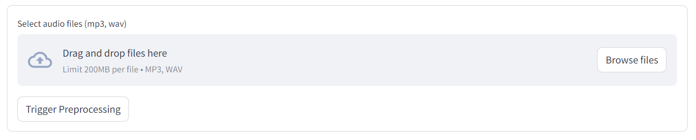

Trigger preprocessing to add your song to the list of songs.  
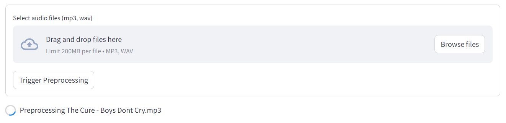  
Once it's done, your song will be added to the list, along with information about its BPM and key. You can also download its analysis and remove any track you want.  
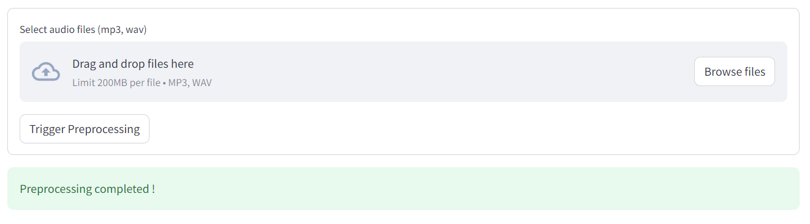

Here you can listen to every segment of the song, and even choose the instrument you want to hear all alone.

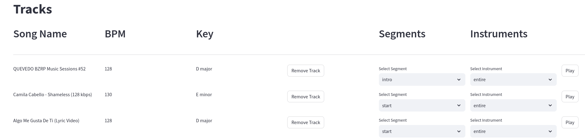

Now, you can start creating your mashup. Just below the song list is an area where you can add the blocks that will form your mashup. Right-click on the area to create blocks.

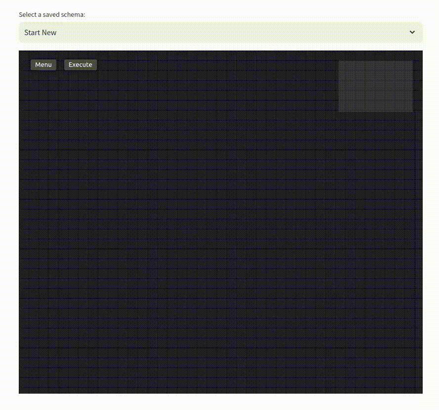

### Track Workflow

First, add your 'Track' blocks and choose the songs you want to mix using the scroll.  

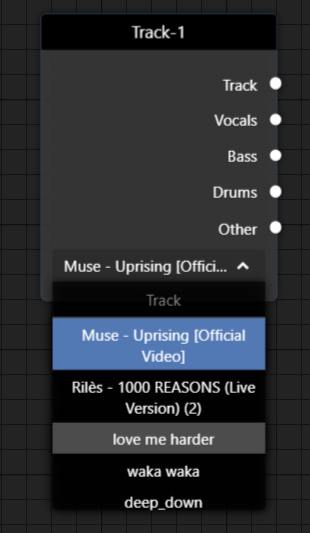

Then, add a 'Mixer' block and choose your mashup technique.  

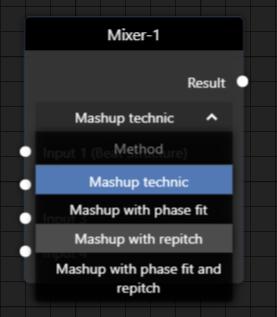

Now, link your 'Track' blocks to your 'Mixer' block by selecting the vocals or instruments of your choice for each input.  

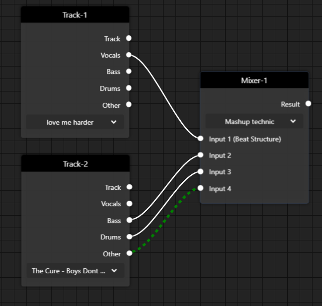

Finally, link your 'Mixer' block to a 'Player' block and choose whether or not to enable the Metronome option to add a metronome noise in the background of your mashup.  

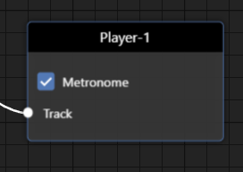

#### Execution

Once it’s done, you can save and execute it.  
It may take a few seconds depending on the mashup technique you choose, and then the player will appear.  

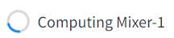  

Congratulations, you can now listen to your own mashup!  

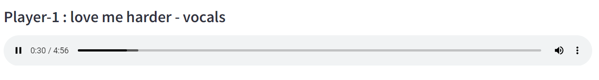

You can also download it if you like the result.

## Saving and loading

You can always save your process and load it back whenever you need it.

### Save
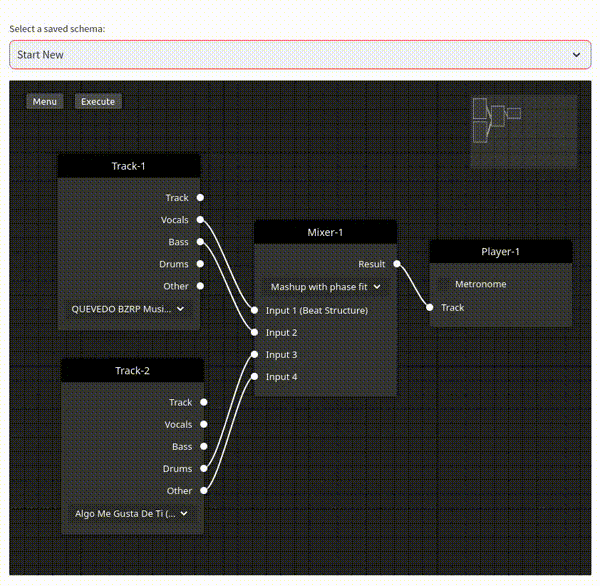

### Load
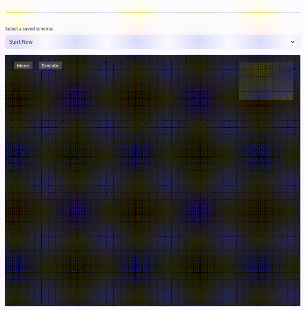